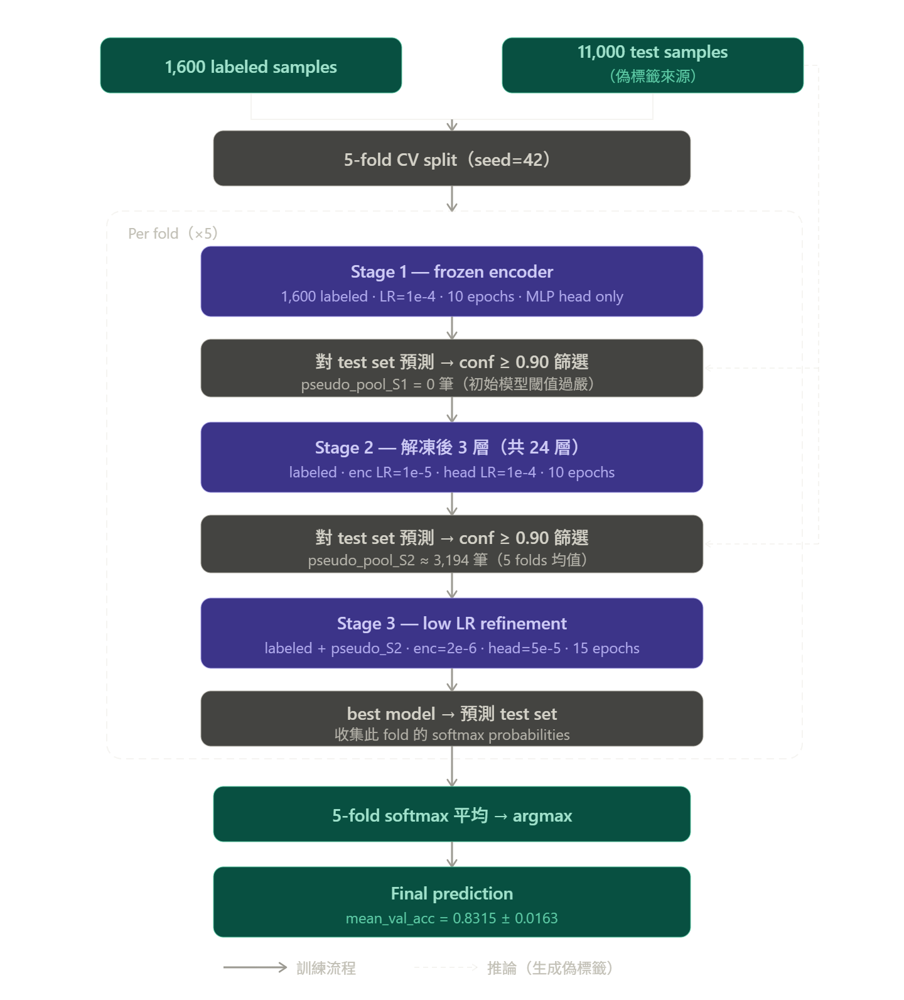
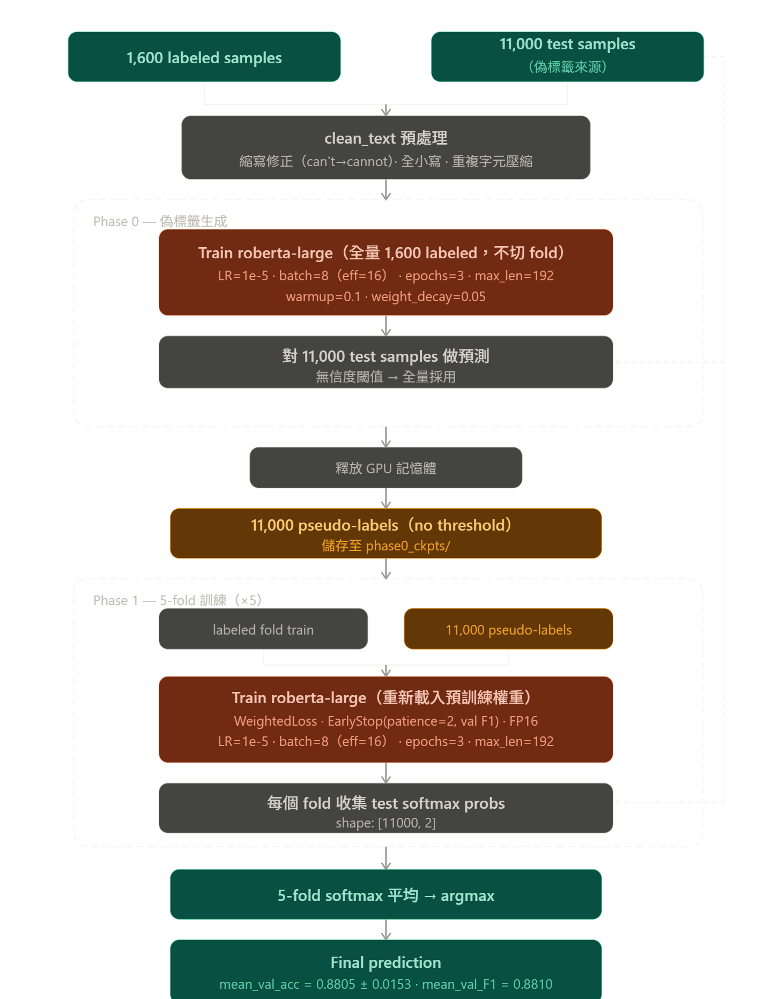

# NLP Sentiment Analysis Report
> Corresponding to the 400BadRequest PDF structure, filled with EXP01 (exp09-05) & EXP02 (exp11-01) content

---

## Abstract

This study uses the Kaggle dataset "Positive/Negative: Text Polarity Classification 26" to address a binary sentiment classification task (positive/negative) under a severely data-scarce setting: only 1,600 labeled samples and 11,000 unlabeled test samples. The insufficient labeled data makes models prone to overfitting with limited generalization ability. How to effectively leverage the large unlabeled test set through pseudo-labeling strategies thus becomes the core research problem. Using RoBERTa-large as the backbone, this study designs and compares two pseudo-labeling strategies: EXP01 adopts a three-stage progressive encoder unfreezing pipeline — Stage 1 freezes the entire encoder and trains only the classification head to establish a stable initial model, while Stages 2–3 progressively unfreeze the last three encoder layers and use a confidence threshold (0.90) to filter pseudo-labels for training set augmentation; EXP02 adopts a two-stage strategy — Phase 0 trains a warm-up model on all labeled data and generates pseudo-labels for the full 11,000 test samples (no confidence threshold), and Phase 1 trains a 5-fold model using each fold's labeled data plus all pseudo-labels, with balanced class weights and Early Stopping. Experimental results show that EXP02 outperforms EXP01 across all metrics (val accuracy: 0.8805 vs. 0.8315; F1: 0.8810; std: 0.0153 vs. 0.0163; public test: 0.77465 vs. 0.77988; private test: 0.77815 vs. 0.79864), indicating that in low-resource scenarios, the strategy of unconditionally incorporating all pseudo-labels on top of a strong pre-trained model achieves more stable generalization than the multi-stage approach of confidence-filtered pseudo-labels combined with progressive unfreezing.

---

## Introduction

- EXP01 (exp09-05) pipeline

- EXP02 (exp11-01) pipeline

Sentiment analysis is one of the core tasks in natural language processing (NLP), widely applied in public opinion monitoring, product review analysis, and social media understanding. Its goal is to automatically identify the sentiment orientation expressed in text — in the case of binary classification, to determine whether a piece of text conveys a positive or negative sentiment. Although pre-trained language models (PLMs) represented by BERT have greatly improved performance on such tasks in recent years, in practical scenarios the acquisition of manually labeled data is often costly. How to fully exploit the potential of models under limited labeled samples remains an important research challenge.

This study uses the Kaggle competition dataset "Positive/Negative: Text Polarity Classification 26." The task is to perform binary sentiment classification on given texts, where label 1 represents positive sentiment and label 0 represents negative sentiment. The dataset contains 1,600 labeled training samples and 11,000 unlabeled test samples, with a severely imbalanced data scale. Preliminary analysis reveals a class imbalance in the training set (more positive samples than negative) and noise in some texts — specifically, split contractions such as `"can t"` (should be `"cannot"`), `"i m"` (should be `"i am"`), and `"won t"` (should be `"will not"`). If these split contractions are not corrected, the tokenizer will fail to properly interpret the semantics, further increasing the difficulty of model learning. Under these conditions, directly fine-tuning all encoder parameters is highly prone to overfitting given the scarcity of labeled samples, severely limiting the model's generalization ability.

Facing these challenges, the core research question is: how to effectively leverage the large unlabeled test set to augment training data and improve model generalization under low-resource conditions. The pseudo-labeling strategy in semi-supervised learning provides a viable path — first train an initial model on limited labeled data, then predict unlabeled samples and add high-confidence predictions as pseudo-labels back into the training set, iteratively strengthening model performance. However, the quality of pseudo-labels and the timing of their introduction have a substantial impact on the final result; introducing low-quality pseudo-labels too early may cause error accumulation, while overly strict filtering leaves too few pseudo-labels to provide effective benefit.

To investigate the effects of different pseudo-labeling strategies on this task, this study designs and compares two RoBERTa-large-based training schemes: EXP01 (exp09-05.png) adopts a three-stage progressive unfreezing pipeline — Stage 1 freezes the encoder to build a stable initial classifier and uses a confidence threshold (0.90) to filter pseudo-labels, while Stages 2–3 progressively unfreeze the last three encoder layers for fine-tuning; EXP02 (exp11-01.png) adopts a two-stage strategy — Phase 0 trains a warm-up model on all labeled data to generate full pseudo-labels for the test set (no filtering threshold), and Phase 1 trains using each fold's labeled data plus all pseudo-labels with balanced class weights and Early Stopping for training stability.

Both experimental schemes share the same five-phase overall structure (as shown in the figures): EDA, data preprocessing, pseudo-labeling strategy, model training, and evaluation, and both use 5-fold cross-validation to ensure result stability. The differences are concentrated in phases three and four: EXP01 uses confidence-filtered pseudo-labels with progressive unfreezing for three-stage training; EXP02 uses full pseudo-labels with class weighting and Early Stopping for two-stage training. By controlling all other conditions, this study compares the performance difference between the two pseudo-labeling strategies in a low-resource sentiment analysis task.

---

## Methodology

### Experiment Overview

This study designs two semi-supervised training schemes centered on pseudo-labeling, both using RoBERTa-large as the backbone and evaluated with 5-fold cross-validation. The core concept of EXP01 is Progressive Unfreezing combined with Self-training: through three training stages, the encoder is first frozen to build a stable classification head, then the last three encoder layers are progressively unfrozen, and pseudo-labels filtered by confidence threshold are incrementally added to the training data. EXP02 adopts a more direct full pseudo-label strategy: Phase 0 generates 11,000 pseudo-labels from full test-set predictions by the warm-up model, which are then directly incorporated in the 5-fold training of Phase 1, with balanced class weights and Early Stopping controlling training stability. The primary difference between the two lies in the pseudo-label filtering strategy and the encoder unfreezing approach.

To ensure reproducibility, both schemes fix the random seed (seed = 42) and call `set_seed()` before training, sequentially setting the random seeds for Python `random`, NumPy, and PyTorch (CPU and CUDA). EXP01 additionally sets `torch.backends.cudnn.deterministic = True` and `torch.backends.cudnn.benchmark = False` to eliminate non-determinism in CUDA convolution operations; EXP02 passes the seed through HuggingFace `TrainingArguments(seed=42)` into the Trainer framework. The 5-fold splits in both schemes use `StratifiedKFold(random_state=42)` to ensure consistent fold assignments across runs.

---

### Data Preprocessing

EXP01 performs no text cleaning and feeds raw text directly to the model. EXP02 applies text normalization before loading data, correcting common split-contraction noise in the dataset. Since contractions in some texts were broken during collection (e.g., `"can t"` should be `"cannot"`, `"i m"` should be `"i am"`), leaving them uncorrected would prevent the tokenizer from properly interpreting contraction semantics, degrading feature extraction quality. EXP02 therefore uses regular expressions to restore common negative contractions, personal pronoun contractions, and auxiliary verb contractions to their full forms, converts all text to lowercase to eliminate case differences, and collapses repeated characters (e.g., `"loooove"` → `"loove"`) to reduce surface noise.

---

### Model Selection

Table 1:

| Item | siebert (run02) | roberta-large (run05) |
|------|----------------|----------------------|
| Pre-training nature | Sentiment-specialized | General-purpose MLM |
| Parameters | ~355M | ~355M |
| Mean val acc | **0.8565** (std=0.0094) | 0.8315 (std=0.0163) |
| Kaggle public score | 0.74490 | **0.77465** |
| Val → public gap | ~0.1115 (overfitting) | ~0.057 (better generalization) |
| Compatibility with custom pipeline | Low (weights already specialized) | High (full language representation) |

Early experiments compared two candidate backbone models: `siebert/sentiment-roberta-large-english` (Hartmann et al., 2023) [2] and `roberta-large` (Liu et al., 2019) [1]. The former is a fine-tuned version of RoBERTa-large on large-scale sentiment classification datasets, theoretically possessing stronger sentiment semantic understanding; the latter is a general-purpose pre-trained model trained with Masked Language Modeling (MLM), with a more complete and malleable language representation space. As shown in Table 1, early experiments using siebert as the backbone (run02) achieved a higher validation accuracy (mean val acc = 0.8565), but the Kaggle public score was only 0.74490, a gap of 0.1115, indicating severe overfitting on this small dataset. In contrast, switching to roberta-large (run05) slightly reduced validation accuracy to 0.8315 but substantially improved the Kaggle public score to 0.77465, narrowing the val-to-public gap to 0.057 and significantly improving generalization. This result indicates that siebert's already-hardened sentiment-specialized representations limit flexibility in the context of multi-stage self-training with progressive unfreezing on a small dataset, whereas roberta-large's intact language representation space is better suited as the backbone for this study's custom training pipeline. Therefore, roberta-large was adopted as the shared backbone for both experimental schemes.

---

### Experimental Pipeline

### EXP01 — Self-training + Progressive Encoder Unfreezing

The core design philosophy of EXP01 is to reduce overfitting risk through a "stabilize first, then expand" progressive strategy under severely data-scarce conditions. The overall training is divided into three stages, with pseudo-labels generated from model predictions on the test set between stages to gradually augment training data. All stages are executed independently under a 5-fold cross-validation framework, with the final predictions being the average softmax probabilities of the best model from each fold.

#### Model Architecture

EXP01 adds a custom classification head on top of the roberta-large encoder: Linear(1024→64) → ReLU → Dropout(0.1) → Linear(64→2). The intermediate layer compresses the 1,024-dimensional encoder output to 64 dimensions, uses ReLU as the activation function to introduce non-linear modeling capacity, and applies Dropout(0.1) to suppress overfitting. This lightweight bottleneck design is especially critical in Stage 1 when the encoder is frozen: Stage 1 trains only the classification head on 1,600 samples, reducing the intermediate dimension to 64 to limit trainable parameters and prevent the classification head from memorizing training noise in a low-data setting.

#### Training Pipeline (3 Stages × 5-fold CV)

**Stage 1 — Frozen Encoder**

Stage 1 freezes all roberta-large encoder layers and trains only the classification head on 1,600 labeled samples (LR = 1e-4, epochs = 10, max_length = 128, label smoothing = 0.1, warmup ratio = 0.1). This stage serves two purposes: first, to build a stable initial classifier without corrupting pre-trained representations; second, to predict the 11,000 test samples and filter those with softmax confidence ≥ 0.90 as the first batch of pseudo-labels (pseudo_pool_S1).

**Pseudo-label volume (Stage 1 → Stage 2)**: Due to the strict 0.90 threshold being too demanding for the Stage 1 initial model, pseudo_pool_S1 was **0 samples** for all folds in this experiment. Stage 2 effectively begins training on pure labeled data.

**Stage 2 — Unfreeze Last 3 Layers**

Stage 2 unfreezes the last 3 Transformer encoder layers of roberta-large (out of 24 total) and fine-tunes with layer-wise learning rates (encoder LR = 1e-5, head LR = 1e-4, epochs = 10, max_length = 128, label smoothing = 0.1, warmup ratio = 0.1). Training data is the 1,600 labeled samples plus pseudo_pool_S1 (0 in this experiment). The encoder LR is set to 1/10 of the head LR, allowing the upper encoder representations to gradually adapt to the sentiment distribution of this dataset while avoiding destruction of lower-layer general language features (catastrophic forgetting). Upon completion, predictions are again made on the 11,000 test samples and those with confidence ≥ 0.90 are selected as pseudo_pool_S2 for Stage 3.

**Pseudo-label volume (Stage 2 → Stage 3)**: The Stage 2 model quality improved substantially. The pseudo_pool_S2 filtered for each fold is shown in Table 2:

Table 2:
| Fold | n_pseudo_S2 |
|------|-------------|
| 0 | 3,040 |
| 1 | 3,036 |
| 2 | 2,879 |
| 3 | 3,563 |
| 4 | 3,451 |
| **Mean** | **3,193.8** |

**Stage 3 — Low-LR Refinement**

Stage 3 uses the best weights from Stage 2 as the warm-start, applying lower learning rates (encoder LR = 2e-6, head LR = 5e-5, epochs = 15, warmup ratio = 0.05) for final refinement of the entire model. Training data consists of 1,600 labeled samples plus pseudo_pool_S2 (average 3,194 samples). No new pseudo-labels are generated; the goal is to converge to a better local optimum on the existing training data.

#### Pseudo-label Strategy

EXP01 uses confidence-threshold filtering (confidence ≥ 0.90) to incorporate only the model's most confident predictions, maintaining pseudo-label quality. However, in Stage 1, because the initial model performance is limited, all folds in this experiment failed to produce any pseudo-labels (pseudo_pool_S1 = 0), effectively making Stage 2 equivalent to training on labeled data only. Effective pseudo-label incorporation was not achieved until after Stage 2, providing an average of ~3,194 additional training samples per fold.

#### Ensemble

In the 5-fold cross-validation, each fold independently completes three training stages and outputs softmax probability distributions on the test set using its Stage 3 best model. The final predictions are obtained by averaging the softmax probabilities sample-wise across all 5 folds, then converting to class labels via argmax. This ensemble strategy leverages the complementarity of models trained on different data splits to reduce random error from any single fold partition.

---

### EXP02 — Phase 0 Pseudo-label + 5-fold Ensemble

The core design philosophy of EXP02 is to fully utilize the 11,000 unlabeled test samples with minimal complexity. The overall training is divided into two stages: Phase 0 trains a warm-up model on all labeled data and generates full pseudo-labels; Phase 1 then trains a 5-fold model using each fold's labeled data plus all pseudo-labels, with balanced class weights and Early Stopping to control training quality.

#### Model Architecture

EXP02 loads roberta-large via HuggingFace `AutoModelForSequenceClassification`, using the default `RobertaClassificationHead` (Dropout → Linear(1024→1024) → Tanh → Dropout → Linear(1024→2)), trained with FP16 mixed precision to save GPU memory. Compared to EXP01's custom lightweight classification head, EXP02 maintains the default full-dimension head and uses the HuggingFace Trainer framework, reducing the complexity of custom code.

#### Text Preprocessing

EXP02 applies text normalization when reading data: converting all text to lowercase, correcting split contractions via regular expressions (e.g., `"can t"` → `"cannot"`, `"i m"` → `"i am"`), and collapsing repeated characters. See Methodology — Data Preprocessing for detailed rules.

#### Training Pipeline (2 Phases × 5-fold CV)

**Phase 0 — Pseudo-label Generation (Warm-up Model)**

Phase 0 trains roberta-large on all 1,600 labeled samples without fold splitting (LR = 1e-5, batch size = 8, gradient accumulation = 2, effective batch = 16, epochs = 3, max_length = 192, warmup ratio = 0.1, weight decay = 0.05). After training, predictions are made on all 11,000 test samples without a confidence threshold — all predictions are directly used as pseudo-labels. GPU memory is released immediately after Phase 0 before entering Phase 1.

**Phase 1 — 5-fold Training**

Phase 1 trains each fold using labeled_fold_train (~1,280 samples) plus the 11,000 pseudo-labels generated in Phase 0 (LR = 1e-5, batch size = 8, gradient accumulation = 2, effective batch = 16, epochs = 3, max_length = 192, warmup ratio = 0.1, weight decay = 0.05). Training uses balanced class weights (WeightedTrainer) to handle class imbalance, and EarlyStoppingCallback (patience = 2, monitoring val F1) to prevent overfitting, saving the best checkpoint each epoch.

#### Pseudo-label Strategy

EXP02 discards confidence-threshold filtering and directly incorporates all 11,000 full predictions from the Phase 0 warm-up model as pseudo-labels into Phase 1 training. The core rationale is that while focusing on high-confidence samples ensures pseudo-label quality, overly strict filtering under severely data-scarce conditions actually limits the augmentation benefit. Although full incorporation includes some low-confidence pseudo-labels, roberta-large's overall prediction quality is sufficient to serve as a weak supervision signal, and class weights combined with Early Stopping can further mitigate the negative impact of lower-quality pseudo-labels.

#### Ensemble

In the 5-fold cross-validation, each fold independently completes Phase 1 training and outputs softmax probability distributions on the test set using its best checkpoint. The final predictions are obtained by averaging the softmax probabilities sample-wise across all 5 folds, then converting to class labels via argmax. This ensemble strategy leverages the complementarity of models trained on different data splits to reduce random error from any single fold partition.

---
## Results

### Shared Settings

Table 3:
| Item | EXP01 | EXP02 |
|------|-------|-------|
| Base model | roberta-large | roberta-large |
| Seed | 42 | 42 |
| CV | 5-fold Stratified | 5-fold Stratified |
| Primary metric | Accuracy | Accuracy + F1 |
| Class balancing | — | Balanced class weights |
| Early stopping | None | patience=2 (val F1) |
| Label smoothing | 0.1 | None |

As shown in Table 3, both schemes use roberta-large as the backbone, 5-fold Stratified CV as the validation framework, and fix the random seed (seed=42) for reproducibility. The main differences lie in class imbalance handling, Early Stopping configuration, and Label Smoothing usage.

### EXP01 Per-Fold Results

Table 4:
| Fold | Stage1 Acc | Stage2 Acc | Best Val Acc | n_pseudo_s2 |
|------|-----------|-----------|-------------|------------|
| 0 | 0.7550 | 0.8325 | 0.8325 | 3,040 |
| 1 | 0.7650 | 0.8225 | 0.8425 | 3,036 |
| 2 | 0.7475 | 0.7875 | 0.8000 | 2,879 |
| 3 | 0.7400 | 0.8225 | 0.8375 | 3,563 |
| 4 | 0.7300 | 0.8300 | 0.8450 | 3,451 |
| **Mean** | 0.7475 | 0.8210 | **0.8315** | 3,193.8 |
| **Std** | — | — | 0.0163 | — |

As shown in Table 4, EXP01's Stage 1 accuracy per fold ranges from 0.730 to 0.765, indicating limited initial performance when the encoder is frozen and only the classification head is trained. After unfreezing the last 3 layers in Stage 2, per-fold accuracy improved substantially (0.788 to 0.833), with a final mean Best Val Acc of 0.8315 (std = 0.0163). Notably, pseudo_pool_S1 was 0 for all folds, with pseudo-labels only generated from Stage 2, providing an average of ~3,194 additional training samples per fold. Fold 2 performed noticeably lower (0.8000), resulting in a relatively larger overall standard deviation (0.0163). Kaggle public score: 0.77465, private score: 0.77815.

### EXP02 Per-Fold Results

Table 5:
| Fold | Val Acc | Val Loss | Val F1 |
|------|---------|----------|--------|
| 0 | 0.8725 | 0.6221 | 0.8765 |
| 1 | 0.9025 | 0.4379 | 0.9051 |
| 2 | 0.8650 | 0.6580 | 0.8670 |
| 3 | 0.8675 | 0.4105 | 0.8630 |
| 4 | 0.8950 | 0.4358 | 0.8934 |
| **Mean** | **0.8805** | — | **0.8810** |
| **Std** | 0.0153 | — | — |

As shown in Table 5, EXP02's per-fold validation accuracy ranges from 0.865 to 0.903, with a mean Val Acc of 0.8805 (std = 0.0153) and mean Val F1 of 0.8810. Fold 1 performed best (Val Acc = 0.9025), while Fold 2 was relatively lower (0.8650) but still outperformed all EXP01 folds. The overall standard deviation (0.0153) is slightly lower than EXP01 (0.0163), indicating more consistent performance across folds. Kaggle public score: 0.77988, private score: 0.79864.

### Overall Comparison

Table 6:
| Item | EXP01 | EXP02 |
|------|-------|-------|
| Mean Val Acc | 0.8315 | **0.8805** |
| Val Acc Std | 0.0163 | **0.0153** |
| Mean Val F1 | — | **0.8810** |
| Kaggle public score | 0.77465 | **0.77988** |
| Kaggle private score | 0.77815 | **0.79864** |
| Pseudo-label volume | ~3,194 (Stage 2) | 11,000 (full) |
| Confidence threshold | 0.90 | None |
| Encoder unfreezing | Last 3 layers (Stage 2+) | Full (Phase 0 & 1) |
| Training stages | 3 × 5 folds | 2 × 5 folds |

As shown in Table 6, EXP02 outperforms EXP01 across all metrics on both the validation set and Kaggle test set. Validation accuracy improved by ~4.9 percentage points (0.8805 vs. 0.8315), and Kaggle private score improved by ~2 percentage points (0.79864 vs. 0.77815). This result indicates that the two-stage strategy of full pseudo-labels with class weighting and Early Stopping outperforms the three-stage strategy of confidence-filtered pseudo-labels with progressive unfreezing in this low-resource setting. In EXP01, the overly strict Stage 1 threshold (pseudo_pool_S1 = 0) effectively prevented pseudo-label incorporation before Stage 2, undermining the intended benefit of the multi-stage design.

---

## Future Work

- [ ] Adjust EXP01 Stage 1 threshold (e.g., 0.80) or increase training epochs to achieve pseudo_pool_S1 > 0

> Improving EXP01 Stage 1: under the same framework, if more pseudo-labels can be generated for Stage 2 training data, whether this enables more efficient Stage 2 training and even more effective Stage 3 training.

- [ ] Compare pseudo-label effects with/without confidence filtering in EXP02

> Investigating whether applying confidence filtering to pseudo-labels in EXP02 can further improve model performance, or whether it hurts performance due to reduced data volume.

- [ ] Try other BERT-family models (DeBERTa-v3, etc.)

> After multiple experiments, RoBERTa-large already performs quite well on this task, but other architectures (e.g., DeBERTa-v3) could be tried to verify whether further improvements are achievable.

- [ ] Add label smoothing to EXP02

> Based on the results from multiple Kaggle submissions, the best validation result is not necessarily the best generalization, and the worst is not necessarily the worst; therefore, how to prevent overfitting and improve generalization in a low-resource setting warrants exploring label smoothing as a potential direction.

---

## References

[1] Liu, Y., Ott, M., Goyal, N., Du, J., Joshi, M., Chen, D., Levy, O., Lewis, M., Zettlemoyer, L., & Stoyanov, V. (2019). RoBERTa: A Robustly Optimized BERT Pretraining Approach. *arXiv preprint arXiv:1907.11692*.

[2] Hartmann, J., Heitmann, M., Siebert, C., & Schamp, C. (2023). More than a Feeling: Accuracy and Application of Sentiment Analysis. *International Journal of Research in Marketing*, 40(1), 75–87.

---

## Appendix

### A. EXP01 Full Hyperparameter Settings

**Model Architecture**

| Item | Setting |
|------|---------|
| Base model | roberta-large |
| Classification head | Linear(1024→64) → ReLU → Dropout(0.1) → Linear(64→2) |
| Precision | FP32 |

**Stage 1**

| Hyperparameter | Value |
|----------------|-------|
| Data | Labeled only (1,600) |
| Encoder | Fully frozen |
| LR (head) | 1e-4 |
| Batch size | 32 |
| Epochs | 10 |
| Max length | 128 |
| Label smoothing | 0.1 |
| Warmup ratio | 0.1 |
| Confidence threshold | 0.90 |
| Seed | 42 |
| n_folds | 5 |

**Stage 2**

| Hyperparameter | Value |
|----------------|-------|
| Data | Labeled + pseudo_pool_S1 (0 in this run) |
| Encoder | Last 3 layers unfrozen (of 24 total) |
| LR (encoder) | 1e-5 |
| LR (head) | 1e-4 |
| Batch size | 32 |
| Epochs | 10 |
| Max length | 128 |
| Label smoothing | 0.1 |
| Warmup ratio | 0.1 |
| Confidence threshold | 0.90 |

**Stage 3**

| Hyperparameter | Value |
|----------------|-------|
| Data | Labeled + pseudo_pool_S2 |
| LR (encoder) | 2e-6 |
| LR (head) | 5e-5 |
| Batch size | 32 |
| Epochs | 15 |
| Max length | 128 |
| Label smoothing | 0.1 |
| Warmup ratio | 0.05 |

---

### B. EXP02 Full Hyperparameter Settings

**Model Architecture**

| Item | Setting |
|------|---------|
| Base model | roberta-large |
| Classification head | HF default RobertaClassificationHead |
| Precision | FP16 (mixed precision) |

**Phase 0**

| Hyperparameter | Value |
|----------------|-------|
| Data | All labeled (no fold split, 1,600 samples) |
| LR | 1e-5 |
| Batch size | 8 |
| Gradient accumulation | 2 (effective batch = 16) |
| Epochs | 3 |
| Max length | 192 |
| Warmup ratio | 0.1 |
| Weight decay | 0.05 |
| Confidence threshold | None (full 11,000 samples) |
| Seed | 42 |

**Phase 1**

| Hyperparameter | Value |
|----------------|-------|
| Data | labeled_fold_train + 11,000 pseudo-labels |
| LR | 1e-5 |
| Batch size | 8 |
| Gradient accumulation | 2 (effective batch = 16) |
| Epochs | 3 (+ EarlyStop) |
| Early stopping patience | 2 (monitoring val F1) |
| Max length | 192 |
| Warmup ratio | 0.1 |
| Weight decay | 0.05 |
| Class balancing | Balanced class weights (WeightedTrainer) |
| n_folds | 5 |
| Seed | 42 |

---

### C. clean_text Contraction Correction Rules (EXP02)

| Original form | Corrected form |
|---------------|----------------|
| `(\w+) t` | `not` (e.g. `can t` → `cannot`) |
| `i m` | `i am` |
| `it s` | `it is` |
| `(\w+) re` | ` are` |
| `(\w+) ve` | ` have` |
| `(\w+) ll` | ` will` |
